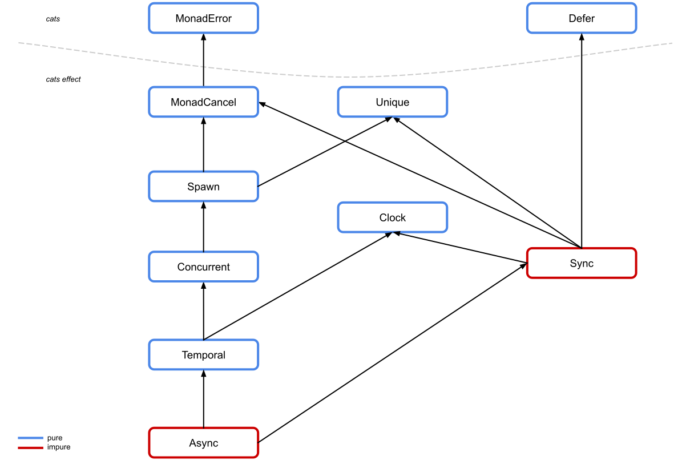

# Cats Effect 3

> ce3, ce3, so wild and free in the sycamore tree

Cats Effect 3 (or "ce3") is an ongoing project designed to fully replace the existing typeclass hierarchy, overhauling semantics and signatures as necessary, as well as bringing significant improvements in safety, rigor, capabilities, and ergonomics.

## Getting Started

At present, no full releases have been published. However, Cats Effect adheres to a stable Git hash snapshot scheme. No guarantees are made about the actual *code* stability of snapshot releases, but the versions themselves are permanent. The latest snapshot release of Cats Effect 3 is [**3.0-bb20d55**](https://github.com/typelevel/cats-effect/tree/bb20d55). If you need a newer snapshot for whatever reason, get in touch with us [in Gitter](https://gitter.im/typelevel/cats-effect-dev)!

At the present time, ce3 is cross-built for Scala 2.12, 2.13, and Dotty 0.25.0-RC2 (once 0.25 goes final, we will be tracking the latest RC in addition to the most recent final build). ScalaJS cross-builds are available for Scala 2.12 and 2.13.

## Contributing

There's lots to do! Ask in the [Gitter channel](https://gitter.im/typelevel/cats-effect-dev) if you are unsure where to begin. At this point, the entire hierarchy is in place, along with most of the laws, and we need to begin porting over the higher level machinery from Cats Effect 2. This is where the majority of the work will happen over the next several months.

## Roadmap

Our goal is to start releasing stable-ish snapshots of the complete framework sometime in Q3 2020, allowing major elements of the ecosystem (such as Monix and fs2) the chance to attempt to port their code over to the new framework, inevitably identifying issues large and small. This ecosystem work is expected to consume the majority of late 2020, during which time we will (hopefully!) resolve most of the major migration sticking points before end-users run into them.

Once all of that is achieved, we will begin a cycle of coordinated release candidates, encouraging the full ecosystem to make the jump, before finally culminating in a coordinated release of a final version across as many projects as possible. In theory, this should culminate roughly around the same time that Scala 3 is fully released, and ce3 will provide fully native Scala 3 support from day one.

## Overview

This section is intended to be a general overview of the project's priorities. It probably isn't exhaustive, nor is it necessarily in any particular order.

### Soundness

The current ce2 hierarchy is quite ad hoc in the sense that it was designed from the ground up mostly without having any idea of what we were doing. The original four classes (`Sync`, `Async`, `LiftIO`, and `Effect`) were substantially derived from a similar prototype hierarchy in [fs2](https://fs2.io), which was originally designed as an abstraction mechanism to avoid hard-coding to Scalaz's `Task` monad. `Task` itself pioneered a lot of these ideas in Scala – including a very early (and very unsound) version of auto-cancelation! – but had long since been superseded by superior implementations, including [Monix `Task`](https://monix.io). All other classes – `Bracket`, `Concurrent`, and `ConcurrentEffect` – were designed specifically for Cats Effect, loosely based on Haskell's [async](https://hackage.haskell.org/package/async) package. To our knowledge, no one had previously attempted to form *abstractions* over these concepts.

Needless to say, honest mistakes were made as the design space was being explored, and many of those mistakes ultimately became codified into the Cats Effect 1.0 API, ossifying compatibility. One obvious example of a wart in CE2 is the `Fiber#join` function, which returns a value of type `F[A]` given a `Fiber[F, A]`. This seems harmless enough, but the failure modes are somewhat non-obvious. For example, consider the following three programs:

```scala
val one = pure(42).start.flatMap(_.join) 

val two = raiseError(new RuntimeException).start.flatMap(_.join)

val thr = sleep(1.second).start.flatMap(f => f.cancel >> f.join)
```

The first program produces `42`, exactly as you would expect. The second fails with a `RuntimeException`, again in line with expectations. The third, however... deadlocks. It will never return, because the underlying fiber was canceled, meaning that `join` has no value to produce! No value, no error, absolutely nothing to do except just... sit there.

This is really difficult to work around in practice. Cancelation is a very frequent element of using Cats Effect in practice, and yet manipulating it directly or even *detecting* it is extremely difficult. As a high-level concrete example, the concept of [supervisor nets](https://erlang.org/doc/man/supervisor.html) makes a great deal of sense when we think about how fibers are `start`ed by a "parent" fiber, which then has the ability to `cancel` or `join` it, and thus one can imagine an implicit directed acyclic graph of dependencies and supervisory capabilities. However, this is impossible since one of the three fundamental outcomes of a fiber, cancelation, cannot be safely observed even by the parent.

One of the major goals of CE3 is to address soundness issues in the hierarchy like the one illustrated here. For example, in CE3, the `join` function produces a value of type `F[Outcome[F, E, A]]`, where `E` is the error type (`Throwable` in the case of `IO`). `Outcome` represents the three possible results explicitly: `Completed`, `Errored`, and `Canceled`, giving callers of `join` the ability to make a decision on the desired semantics.

### Safety

`Sync` and `Async` are rather odd classes. The definition of `Sync`, for example, can be simplified to the following:

```scala
trait Sync[F[_]] extends MonadError[F, Throwable] {
  def delay[A](thunk: => A): F[A]
}
```

Which is to say, `Sync` is responsible for capturing lazy evaluation and lifting it into a value of type `F[A]`, specifically for the purpose of capturing *side-effects* and turning them into *values*. `Async` is analogous for asynchronous (callback-driven) side-effects.

This is a rather dangerous operation, when you think about it, since there is no limit on what can be done with such a capability! Given an `F[String]` and the knowledge that `F` forms a `Sync`, you will have a very hard time figuring out where the `String` might be coming from! Maybe that `F[String]` is actually wrapping around `readLine()`. Or maybe it's making a network call. Or maybe it's just a `String` literal! All of these (and infinitely more) are possible.

In a very real sense, `Sync` and `Async` are the most powerful classes in the entire hierarchy. They are the FFI which connects purely functional code together with imperative side-effecting code. Thus, it's rather odd that these *extremely* powerful typeclasses are *implied by* the most semantically-oriented class in the hierarchy: `Concurrent`.

`Concurrent` is really very nice in a lot of ways. It gives us the ability to talk about independent fibers (lightweight threads) and parallel execution in a sane and convenient fashion. In a sense, it's really just a control-flow typeclass not unlike `Monad` (which describes dependent sequential computation). However, due to the fact that `Sync` sits *above* `Concurrent` (meaning that all `Concurrent`s are also `Sync`s), the following doesn't make very much sense:

```scala
def foo[F[_]: Concurrent]: F[Unit] = ???
```

So `foo` has some type parameter, `F[_]`, which can do concurrent things... and literally anything else it wants to do by capturing side-effects.

That's really really strange. It would be much nicer if we could say "this function does concurrent things and *cannot* capture side-effects", since capturing side-effects is such an explicitly dangerous thing to do. Any function which requires a `Sync` should be viewed with suspicion, while functions which require `Concurrent` should be considered "safe".

To this end, the CE3 hierarchy has been entirely redesigned:



`Concurrent` now sits at the top of the hierarchy. `Concurrent` has no ability to capture or control side-effects; its sole purpose is to describe parallel evaluation. Similarly, `Temporal` sits below `Concurrent` and enriches it with time-related semantics. Finally, `Async` and `Sync` still represent an FFI for interacting with effectful, imperative side-effects, and they sit at the *bottom* of the hierarchy, representing nearly the most powerful capability you can have. The only capability which sits below `Async` is `Effect`, which represents an `F` which is *literally* `IO` (or something very very much like it).

You'll note that `Bracket` is absent. This is because the addition of a more general `uncancelable` combinator on `Concurrent` has rendered `bracket` a derivative operation, and it is simply defined by `Concurrent` in terms of other primitives.

#### Simplifying Dependencies

Speaking of `Effect`, it has been redefined to remove the dependency on `IO`. The following is its simplified definition:

```scala
trait Effect[F[_]] extends Async[F] {
  def to[G[_]](fa: F[A])(implicit G: Effect[G]): G[A]
}
```

In other words, any `Effect` is defined by its ability to replicate itself in terms of some arbitrary `G` which is itself an `Effect`, meaning that it must be exactly as powerful as any other effect type, including `IO` itself.

For framework authors who require the ability to *run* an effect in a polymorphic context, the following idiom is now available:

```scala
def unsafeRunAndForget[F[_]: Effect, A](fa: F[A]): Unit =
  fa.to[IO].unsafeRunAsyncAndForget()
```

Additionally, it is possible for third-party effect types such as Monix's `Task` to avoid any dependency on `IO` by simply depending on the typeclasses and nothing else.

### Lawfulness

Typeclasses represent *systems of axioms*. They are defining behaviors in a very abstract way. This abstraction is useful both for those who might *implement* the abstraction, such as `IO`, as well as those who might *use* the abstraction, such as frameworks like Doobie. The implementors of the abstraction need to know whether or not they have correctly implemented the intended and required semantics defined by the abstraction, while users of the abstraction need to know that their code behaves identically and as-expected on *all possible* implementations of the abstraction. This is a delicate balance.

Static types are wonderful, but they are simply not enough to achieve this goal. For example, the following is a (simplified) type signature from the `Concurrent` class:

```scala
def uncancelable[A](body: F ~> F => F[A]): F[A]
```

It's really not very clear at all what this function does, and there are *many* possible implementations, most of which likely have very little to do with cancelation. For example, the following implementation entirely satisfies the type given above:

```scala
def uncancelable[A](body: F ~> F => F[A]): F[A] =
  body(FunctionK.id)
```

This is definitely not correct. But it compiles!

Laws are the way in which we prevent this. For example, one of the laws for `uncancelable` looks like this:

```scala
  def uncancelablePollIsIdentity[A](fa: F[A]) =
    F.uncancelable(_(fa)) <-> fa
```

This is to say that, for *any* program `F[A]`, applying the natural transformation given by `uncancelable` to that program and then returning it is the same as the identity function. So far, we haven't actually prevented our strawman implementation. However, *this* law does:

```scala
  def uncancelableCanceledAssociatesRightOverFlatMap[A](a: A, f: A => F[Unit]) =
    F.uncancelable(_ => F.canceled.as(a).flatMap(f)) <-> (F.uncancelable(_ => f(a).attempt) >> F.canceled)
```

It takes just a little more digesting, as well as knowledge of the existence of the `canceled` function (also in `Concurrent`), but this law ensures that `uncancelable` suppresses cancelation for the duration of the block, reassociating the signal to the *end* of the block. Thus, programs which are canceled while within an `uncancelable` block are still *canceled*, but they are not interrupted until the end of the block. Our strawman implementation will fail this law, as will most incorrect implementations of `uncancelable`.

Laws are more than just a [TCK](https://en.wikipedia.org/wiki/Technology_Compatibility_Kit), though. Laws can also be thought of as constructive reasoning tools for generating the space of potential valid programs. Or, equivalently, for defining the step-wise evaluation semantics for any given program.

Notice how the laws are written in terms of the `<->` "rewrite" operator. This operator simply turns into a ScalaCheck property in practice, but in *theory* it should be read as something much more powerful: an equational substitution.

The first law is saying that any time we see a program which contains the pattern `F.uncancelable(poll => poll(...))` for *any* value of the `...` subexpression, we can rewrite it as just the `...` subexpression itself. This kind of step-wise evaluation semantic is the foundation of all formal computational calculi, including Scala itself (as of Dotty, via the DOT calculus).

Unfortunately, due to expressiveness limitations, not *all* programs can be reduced to a simple composition of these evaluation rules (laws). However, significantly more such programs can be reduced now than was possible with the laws framework in ce2, in which a single law very frequently reduced to a rewrite asserting one side was equal to `F.pure(...)` of some value, which is a rewrite of very limited applicability.

All laws in ce3 must pass the litmus test of step-wise evaluation in sufficient generality. This guideline has guided the framework into a far more "first principles" oriented approach toward design, eliminating many early concepts which were ill-defined or ad hoc and replacing them with clean, orthogonal, and composable generalizations.

### Generality

Several abstractions have been generalized to avoid over-specifying semantics and closing off useful possibilities. A good example of this is the simplification of `bracket` within the hierarchy. In Cats Effect 2, `bracketCase` is a primitive defined by the `Bracket` typeclass:

```scala
def bracketCase[A, B](acquire: F[A])(use: A => F[B])(release: (A, ExitCase[E]) => F[Unit]): F[B]
```

Unfortunately, this operation does not compose in a fashion which is consistent with other operations, such as `handleErrorWith`. For example, if we attempt to define this function for `EitherT[F, E, A]` where `F` forms a `Bracket`, we're going to run into problems with the following type of code:

```scala
bracketCase(acquire)(use) { (a, c) =>
  EitherT.leftT[F, A](MyError)
}
```

Where does `MyError` go? The only sane answer is that it propagates out and is the final result of the `bracketCase` effect in this instance, but the only way to achieve this on CE2 is to use a mutable `Ref` which catches the error case and rematerializes it after the finalizer has run. This is extremely broken, and that brokenness manifests in the fact that the `Bracket[EitherT[F, E1, *], E2]`  instance actually requires a `Sync[F]`, rather than a `Bracket[F, E2]` (which would be much more sensible).

Cats Effect 3 resolves this issue by removing `bracketCase` as a *primitive*. Instead, it is now defined in terms of `uncancelable`, `onError`, `onCancel`, and `flatMap`. Specifically, it looks like this:

```scala
def bracketCase[A, B](
    acquire: F[A])(
    use: A => F[B])(
    release: (A, Outcome[F, E, B]) => F[Unit])(
    implicit F: Concurrent[F, E])
    : F[B] =
  F uncancelable { poll =>
    acquire flatMap { a =>
      val finalized = poll(use(a)).onCancel(release(a, Outcome.Canceled()))
      val handled = finalized onError {
        case e => release(a, Outcome.Errored(e)).attempt.void
      }

      handled.flatTap(b => release(a, Outcome.Completed(pure(b))).attempt)
    }
  }
```

Note that `onError` is defined by `ApplicativeError` in terms of `handleErrorWith`, which does the right thing with our `EitherT` example from earlier. `onCancel` is now a primitive, rather than being derived from `bracketCase`, and this *in turn* actually considerably simplifies and improves the performance of concrete effect types such as `IO`.

### Ergonomics

A lot of the ideas in Cats Effect 2 are very very good and have proven their value in facilitating the growth of a vibrant and powerful ecosystem for building real-world software. However, some of the ideas have turned out to be duds and hinder far more often than they help.

The most notable example of the latter is `ContextShift`. When Cats Effect was originally being designed, a decision was made regarding the `async` function in the `Async` typeclass. Namely, the decision was that the *continuation* of a computation as triggered by the running of a callback would *not* automatically shift to a thread pool. At the time, this seemed like a relatively reasonable choice. Scalaz's `Task` mirrored these semantics, and while it often resulted in a significant degree of user confusion about which pool was running their code, that didn't seem to hinder its usefulness. Additionally, use-cases such as Swing's `EventDispatcher` seemed to indicate that *not* "auto-shifting" was the correct strategy.

It was the incorrect strategy.

The fact that `async` does *not* auto-shift means that there is no way to generally reason about the underlying `ExecutionContext` running your code when working with the abstractions. `ContextShift` was an attempt to bring *some* control to this madness, but in practice, there is no pitfall which trips up users more frequently than this one. It is unambiguously confusing. All the while, the presumed benefits of avoiding auto-shifting (performance and control) have failed to materialize or been rendered moot.

It doesn't really make any sense to perpetuate this mistake. Instead, ce3 explicitly codifies the role of `ExecutionContext` control in the `Async` typeclass. Its simplified definitions is as follows:

```scala
trait Async[F[_]] extends Sync[F] with Temporal[F, Throwable] { self: Safe[F, Throwable] =>

  def async[A](k: (Either[Throwable, A] => Unit) => F[Option[F[Unit]]]): F[A]

  def evalOn[A](fa: F[A], ec: ExecutionContext): F[A]

  def executionContext: F[ExecutionContext]
}
```

If you look very closely, you'll notice that `evalOn` and `executionContext` look a lot like `local` and `ask` from the [`Reader` monad](https://typelevel.org/cats/datatypes/kleisli.html). For this reason, we say that all effects which are `Async` must "form a reader over `ExecutionContext`". This property ensures that one and only one `ExecutionContext` is available to any computation, always.

The `evalOn` function gives users *control* over this `ExecutionContext`, making it possible to safely shift a scoped computation from one pool to another without having to worry about cleaning up or shifting back: the system will shift back *for you*. The following pair of laws describes this behavior quite succinctly:

```scala
  def executionContextCommutativity[A](fa: F[A]) =
    (fa *> F.executionContext) <-> (F.executionContext <* fa)

  def evalOnLocalPure(ec: ExecutionContext) =
    F.evalOn(F.executionContext, ec) <-> F.evalOn(F.pure(ec), ec)
```

The first law states that, in a given scope, `executionContext` must return the same result *regardless* of the program around it. This means that `async` continuations must always shift back to whatever pool is indicated by `executionContext`, otherwise the law could not be satisfied.

The second law governs the `evalOn` mechanism and constrains `executionContext` to exactly produce the `ExecutionContext` which was specified by the user. This ensures users have full control over the scheduling semantics, regardless of the underlying implementation.

This is one of several usability issues which have been corrected in ce3 as part of the redesign.

You may have also noticed in the above definition of `Async` that the `async` *function* is somewhat different. Specifically, its body now produces a result in `F`, and that result is of type `Option[F[Unit]]`. In fact, this is very close to the signature of `cancelableF` in Cats Effect 2. This revised signature reflects two things:

- The registration of a callback is an *effect* and should be treated as such, rather than captured as a side-effect and coerced to `Unit`
- Many (but not all) asynchronous effects have some form of cancelation mechanism, and the cancelation mechanism in Cats Effect should be made aware of this when capturing such effects.

An example of a cancelable callback-driven effect is the use of a `ScheduledExecutorService` to sleep for some time period before awakening. The natural cancelation action for such an effect would be to remove the awakening from the schedule, thereby freeing up resources.

All of this functionality is *possible* in Cats Effect 2, but quite a bit harder to get at, requiring the user to remember one of four possible APIs for achieving nearly the same goal. In Cats Effect 3, there is a single function which encompasses the full generality of callback encapsulation.
