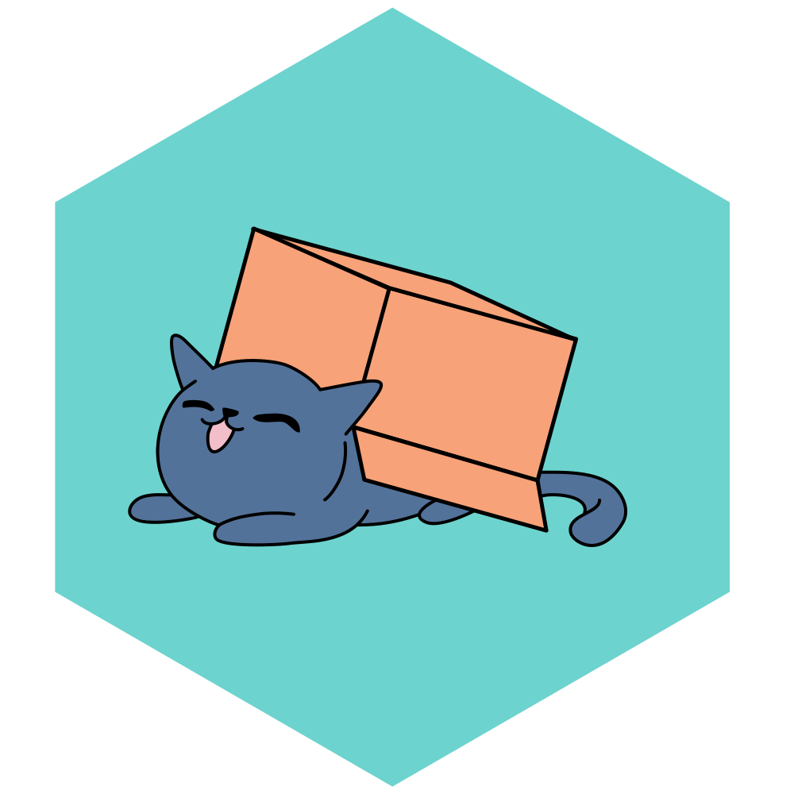
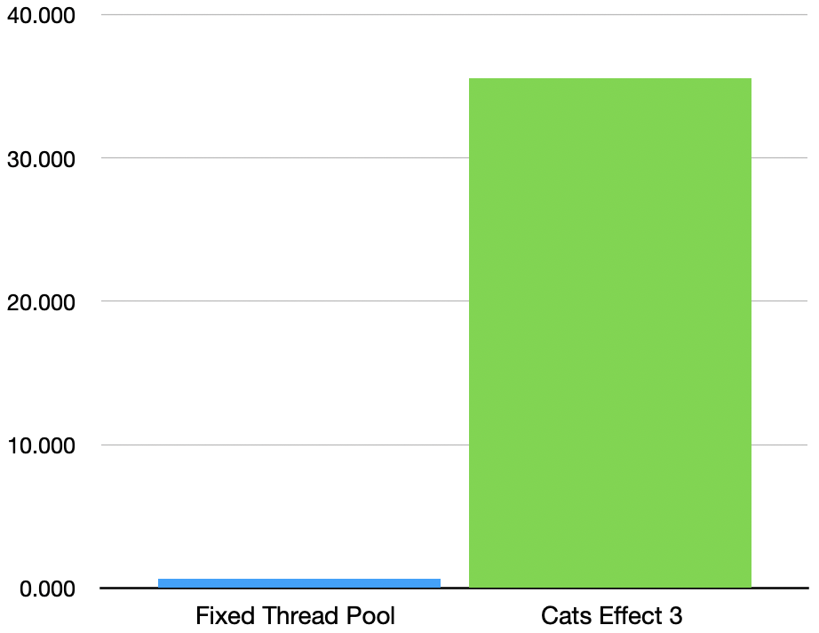

# Cats Effect

[](https://index.scala-lang.org/typelevel/cats-effect/cats-effect)
[](https://discord.gg/QNnHKHq5Ts)



<p>Cats Effect is a high-performance, asynchronous, composable framework for building real-world applications in a purely functional style within the Typelevel ecosystem. It provides a concrete tool, known as "the <code>IO</code> monad", for capturing and controlling actions, often referred to as "effects", that your program wishes to perform within a resource-safe, typed context with seamless support for concurrency and coordination. These effects may be asynchronous (callback-driven) or synchronous (directly returning values); they may return within microseconds or run infinitely.</p>

<p>Even more importantly, Cats Effect defines a set of typeclasses which define what it means to be a purely functional runtime system. These abstractions power a thriving ecosystem consisting of streaming frameworks, JDBC database layers, HTTP servers and clients, asynchronous clients for systems like Redis and MongoDB, and so much more! Additionally, you can leverage these abstractions within your own application to unlock powerful capabilities with little-or-no code changes, for example solving problems such as dependency injection, multiple error channels, shared state across modules, tracing, and more.</p>

## Getting Started

- Wired: **3.4.11**
- Tired: **2.5.5** (end of life)

```scala
libraryDependencies += "org.typelevel" %% "cats-effect" % "3.5.0"
```

The above represents the core, stable dependency which brings in the entirety of Cats Effect. This is *most likely* what you want. All current Cats Effect releases are published for Scala 2.12, 2.13, 3.0, and Scala.js 1.7.

Or, if you prefer a less bare-bones starting point, you can try [the Giter8 template](https://github.com/typelevel/ce3.g8):

```bash
$ sbt new typelevel/ce3.g8
```

Depending on your use-case, you may want to consider one of the several other modules which are made available within the Cats Effect release. If you're a datatype implementer (like [Monix](https://monix.io)), you probably only want to depend on **kernel** (the typeclasses) in your compile scope and **laws** in your test scope:

```scala
libraryDependencies ++= Seq(
  "org.typelevel" %% "cats-effect-kernel" % "3.5.0",
  "org.typelevel" %% "cats-effect-laws"   % "3.5.0" % Test)
```

If you're a middleware framework (like [Fs2](https://fs2.io/)), you probably want to depend on **std**, which gives you access to `Queue`, `Semaphore`, and much more without introducing a hard-dependency on `IO` outside of your tests:

```scala
libraryDependencies ++= Seq(
  "org.typelevel" %% "cats-effect-std" % "3.5.0",
  "org.typelevel" %% "cats-effect"     % "3.5.0" % Test)
```

You may also find some utility in the **testkit** and **kernel-testkit** projects, which contain `TestContext`, generators for `IO`, and a few other things:

```scala
libraryDependencies += "org.typelevel" %% "cats-effect-testkit" % "3.5.0" % Test
```

Cats Effect provides backward binary compatibility within the 2.x and 3.x version lines, and both forward and backward compatibility within any major/minor line. This is analogous to the versioning scheme used by Cats itself, as well as other major projects such as Scala.js. Thus, any project depending upon Cats Effect 2.2.1 can be used with libraries compiled against Cats Effect 2.0.0 or 2.2.3, but *not* with libraries compiled against 2.3.0 or higher.

### Updating from Cats Effect 1.x / 2.x

Check out the [migration guide](https://typelevel.org/cats-effect/docs/migration-guide)!

## Hello, World

```scala
import cats.effect._

object Main extends IOApp.Simple {
  val run = IO.println("Hello, World!")
}
```

Or, if you need the ability to take arguments and return exit codes:

```scala
import cats.effect._

object Main extends IOApp {
  def run(args: List[String]): IO[ExitCode] =
    if (args.headOption.map(_ == "--do-it").getOrElse(false))
      IO.println("I did it!").as(ExitCode.Success)
    else
      IO.println("Didn't do it").as(ExitCode(-1))
}
```

## Five Simple Rules

Any program written using Cats Effect provides incredibly strong guarantees and powerful functionality, performance, safety, and composability, provided you follow each of the following rules:

- **Wrap *all* side-effects** in `delay`, `async`, `blocking`, or `interruptible`/`interruptibleMany`
  + (pro tip: try to keep the size of your `delay` blocks small; two `delay`s with a `flatMap` is much better than one big `delay`)
- **Use `bracket` or `Resource`** for anything which must be `close`d
- ***Never* hard-block a thread** outside of `blocking` or `interruptible`/`interruptibleMany`
- **Use `IOApp`** instead of writing your own `def main`
- Never call anything that has **the word `unsafe` in the name**

If you follow these rules, and you use libraries and frameworks which also follow these rules, you will get a truly astonishing array of things essentially for free:

- Extremely high performance, elastic, and scalable applications
- Proven backpressure mechanisms under extreme load in real deployments
- Reliable resource safety in all cases
- Aggressive interruption of unnecessary work (e.g. timeouts), automatically, without any extra implementation effort
- Composable and modular application architecture (real, *practical* functional programming)
- Simple, safe, and incredibly powerful concurrency mechanisms that get *faster* under high contention
- Highly tuned application runtime with optimized threading and memory management semantics
- Powerful and orthogonal abstractions which enable architectural decomposition that scales to any problem space
- Access to an entire ecosystem of uniquely powerful libraries and tooling
- …and so much more

## Performance



<p>Most functional and async frameworks will tout their performance on synthetic microbenchmarks, measuring things like how many <code>flatMap</code>s they can evaluate per microsecond and so on. However, most programs aren't just a bunch of <code>flatMap</code>s, and the true performance bottlenecks are usually in things like contention scaling under high load, memory and other resource management, backpressure, page faults, and such. In these areas, Cats Effect is truly unrivaled on the JVM, and in most cases, applications written in a purely functional style using Cats Effect will <em>exceed</em> the performance and elasticity of the same applications written in an imperative style.</p>

<p>The chart to the right shows the results of a synthetic benchmark simulating an extremely high-contention scheduling scenario. The scenario is typical of something like a microservice handling extremely high requests-per-second, with each request representing some sort of scatter/gather semantic in which many complex asynchronous actions must be taken in parallel to produce a timely response.</p>

[The benchmark](https://github.com/typelevel/cats-effect/blob/220d0106ca0ff6106746a41504b6ab07d8fc9199/benchmarks/src/main/scala/cats/effect/benchmarks/WorkStealingBenchmark.scala) measures the performance of a typical "disruptor pattern" application written using a fixed thread pool (from `java.util.concurrent.Executors`) compared to the same workflow implemented using Cats Effect (specifically version 3.0). The scores are not a typo: Cats Effect is *almost 55x faster* than the typical disruptor-style, hand-tuned implementation. Similarly dramatic results are consistently observed when comparing Cats Effect with other popular asynchronous and functional frameworks.

As always, benchmarks are one thing, and your application is its own special snowflake with its own performance profile. Always measure and test *your application* before assuming that someone else's performance results apply in your use-case. When in doubt, [come talk with us](https://discord.gg/QNnHKHq5Ts) and we'll give you an honest opinion!

## Abstraction


Cats Effect isn't just designed to enable high performance applications with out-of-the-box safety and elasticity under load. It was intended first and foremost as a tool for implementing *composable* and *reasonable* software that is easy to write, easy to test, and easy to evolve as your team and requirements change over time. To achieve this goal, Cats Effect embraces and enables strong, typeful, purely-functional programming styles that are uniquely tailored for the Scala language.

The typical Cats Effect system is often built in terms of simple, orthogonal, primitive capabilities which come together to represent all the expressive power necessary to encode a modern asynchronous runtime. Much like how the rules of addition, multiplication, and integers come together to define much of what we understand about basic arithmetic, so too do the rules of `Functor`, `Monad`, and `Concurrent` come together to define the nature of a *program* which has all the capabilities you need.

By learning and leveraging these capabilities directly, it is possible to write functions and classes which clearly state their requirements and capabilities in a *statically typed* and discoverable fashion, improving documentation, readability, and separation of concerns.

And, just as with arithmetic, even when you don't directly leverage the nature of abstract mathematics in your daily life, those laws are still present shaping the world around you and enabling powerful and surprising things like computers and trains and restaurant menus. The laws and abstractions of Cats Effect support a powerful and unique ecosystem of frameworks, giving you access to rich and advanced functionality unparalleled in any language or ecosystem, battle tested in production environments ranging from some of the largest companies in the world to some of the nimblest startups.

## Contributing

Please see [**CONTRIBUTING.md**](CONTRIBUTING.md) for more details. Lots to do!

### Website

To build the documentation site locally, the following dependencies are needed, in addition to `sbt`.

- Node (14.x ideally)
- Yarn (any version should work)

NOTE: [Nix](https://nixos.org/) users can just run `nix-shell` at the root directory and follow along the next instructions.

Next, check out the documentation branch along with its submodules.

```
git checkout --track origin/docs
git submodule update --init --recursive
```

Finally, build the site.

```
./build.sh host
```

If everything goes well, your browser will open at the end of this.

## Tool Sponsorship

Development of Cats Effect is generously supported in part by [YourKit](https://www.yourkit.com) through the use of their excellent Java profiler.

## License

```
Copyright 2017-2022 Typelevel

Licensed under the Apache License, Version 2.0 (the "License");
you may not use this file except in compliance with the License.
You may obtain a copy of the License at

   http://www.apache.org/licenses/LICENSE-2.0

Unless required by applicable law or agreed to in writing, software
distributed under the License is distributed on an "AS IS" BASIS,
WITHOUT WARRANTIES OR CONDITIONS OF ANY KIND, either express or implied.
See the License for the specific language governing permissions and
limitations under the License.
```

[Code of Conduct]: https://github.com/typelevel/cats-effect/blob/series/3.x/CODE_OF_CONDUCT.md
